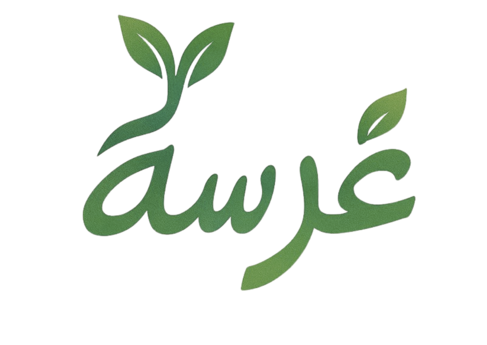
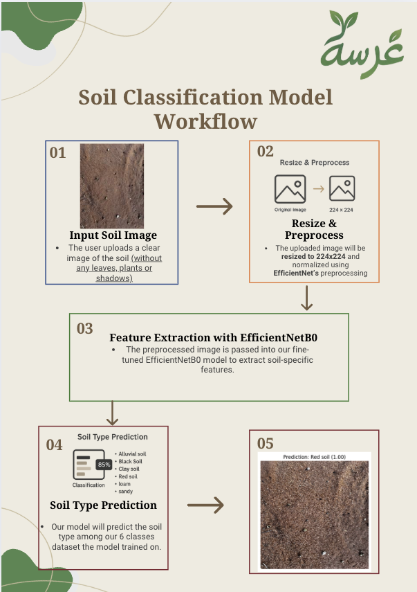
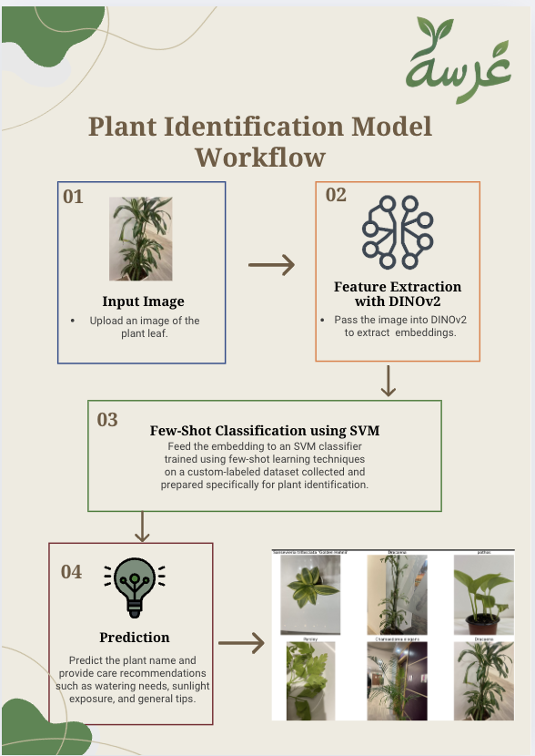
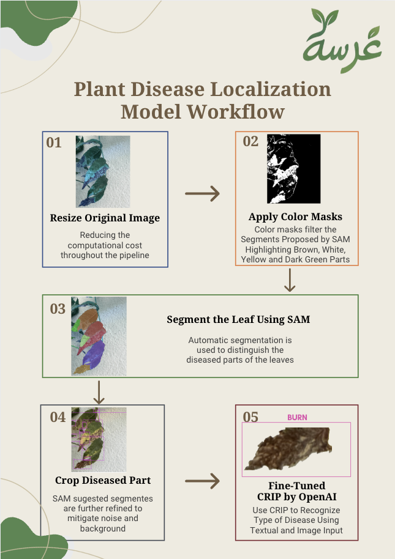
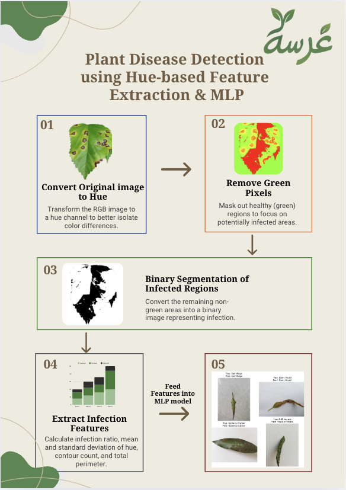

# Gharsa: AI-Powered Plant Advisor for Home Growers


<p align="center">
  
</p>


[](https://www.python.org/)
[](https://fastapi.tiangolo.com/)
[](https://streamlit.io/)
[](LICENSE)


## Overview 

**Gharsa (غرسة)** is a smart AI assistant built for beginners and plant lovers who want to grow with confidence — whether they’re exploring a new plant, checking soil quality, or spotting signs of disease. No expertise needed — just a photo.  


 **Found a plant and don’t know what it is?**  
Upload a photo and get its name, uses, care tips, and possible allergies.

 **Unsure what grows in your backyard soil?**  
Upload a soil image to receive its type, fertility tips, and suggested crops.

 **Your plant leaf looks infected?**  
Upload a leaf photo to get a diagnosis and treatment recommendation.


---


## 📋 Table of Contents

1. [About the Project](#-about-the-project)
2. [Features](#-features)
3. [How It Works](#-how-it-works)
4. [Project Structure](#-project-structure)
5. [Getting Started](#-getting-started)
6. [Technologies Used](#-technologies-used)
7. [Team Members](#-team-members)

---


##  Features

| Feature                | Input       | Output                                         | Model Used                     |
|------------------------|-------------|------------------------------------------------|--------------------------------|
| 🌱 Soil Classification | Soil Image  | Soil type + Fertility tips + Crop suggestions | EfficientNet CNN              |
| 🌿 Plant Identification| Plant Image | Name + Nickname + Usage + Allergies + Care    | DinoV2 + SVM (Few-shot learning) |
| 🍂 Disease Detection   | Leaf Image  | Disease name + Explanation + Treatment        | Hue-based Feature Extraction + MLP |


## 🧠 How It Works

Each core feature in **Gharsa** is powered by a dedicated AI model. Below is a breakdown of how each module works:


<table>
  <tr>
    <td width="50%" align="center">
      <h3>🌱 Soil Classification</h3>
      <br>
      <p style="font-size: 14px;">
        EfficientNet-based CNN to classify soil types and provide crop suggestions.
      </p>
    </td>
    <td width="50%" align="center">
      <h3>🌿 Plant Identification</h3>
      <br>
      <p style="font-size: 14px;">
        Uses DINOv2 embeddings + SVM classifier trained via few-shot learning.
      </p>
    </td>
  </tr>
  <tr>
    <td width="50%" align="center">
      <h3>🍂 Disease Detection</h3>
      <br>
      <p style="font-size: 14px;">
        Detects infected regions using hue-based features.
      </p>
    </td>
    <td width="50%" align="center">
      <h3>🧪 Disease Classification</h3>
      <br>
      <p style="font-size: 14px;">
        Multi-layer perceptron (MLP) classifier to determine disease type.
      </p>
    </td>
  </tr>
</table>
---

## 📂 Project Structure

<pre>
Gharsa/
├── backend/                         # FastAPI backend
│   ├── fastapi_app.py              # Main backend app with endpoints
│   ├── models/                     # Trained ML models (.pkl, .keras)
│   │   ├── efficientnet_model_soils2.keras
│   │   ├── plant_identifier_SVM_model.pkl
│   │   └── plant_label_encoder.pkl
│   └── __pycache__/
│
├── frontend/                        # Streamlit frontend
│   ├── Gharsa.py                   # Main Streamlit app
│   ├── Pages/                      # Subpages
│   │   ├── Check_your_plant.py     # Disease detection page
│   │   ├── Plant_your_plant.py     # Soil classification page
│   │   ├── Plants_info.py          # Plant care info page
│   │   ├── Team_members.py         # Team presentation page
│   │   └── what_is_the_plant.py    # Plant identification page
│   ├── fonts/                      # Custom Arabic font
│   ├── images/                     # UI images and assets
│   └── videos/                     # Demo or promotional videos (if any)
│
├── notebooks/                      # Jupyter Notebooks for training/testing
│   ├── finetune_clip_on_leaf_diseases.ipynb
│   ├── Plant_Disease_Detection_MLP.ipynb
│   ├── plant_identification_with_dinov2_and_svm.ipynb
│   ├── prepare_train_data.ipynb
│   ├── soil_mAP 85_EfficientNetB0.ipynb
│   └── three_step_seg_no_fine_tune.ipynb
│
├── requirements.txt                # Python dependencies
├── README.md                       # Project documentation
└── assets/                         # Project logo and visual assets
</pre>


## 🚀 Getting Started


### Prerequisites
- Python 3.10+
- Virtual Environment (recommended)
- 

### Installation
1. Clone the repository:
   ```bash
   git clone https://github.com/AI-bootcamp/capstone-project-batch3-gharsa-1.git
   cd gharsa

2. install dependicies:
    ```bash
    pip install -r requirements.txt

3. Run the FastAPI backend:
    ```bash
   uvicorn backend.fastapi_app:app --reload --port 8000

4. Run the Streamlit frontend:
    ```bash
   streamlit run frontend/Gharsa.py


## 💻 Technologies Used


* **FastAPI**: Lightweight Python API framework
* **Streamlit**: Interactive UI in Python
* **TensorFlow/Keras**: For CNN-based soil classification
* **PyTorch**: 
* **DinoV2**: For image embedding and plant recognition
* **OpenCV**: Image processing and annotations


## 🌐 Deployment

Gharsa is fully deployed, with its backend models hosted on external servers and seamlessly connected to the Streamlit-based frontend.

###  Backend Deployment (FastAPI)

Each model was deployed independently on a server using FastAPI, and exposed through dedicated API endpoints:

| Feature                | Endpoint URL                                                                 | Description                          |
|------------------------|-------------------------------------------------------------------------------|--------------------------------------|
| 🌱 Soil Classification | [`/predict`](https://soil-model-api.onrender.com/predict)                     | Classifies soil and suggests crops   |
| 🌿 Plant Identification| [`/recognize`](https://multimedia-armed-initiatives-yorkshire.trycloudflare.com/recognize) | Identifies the plant and offers care info |
| 🍂 Disease Detection   | [`/detect`](https://declared-successful-restructuring-below.trycloudflare.com/detect)      | Detects disease from a leaf image    |

These APIs are deployed on  server and can be accessed directly or via the frontend interface.

###  Frontend Deployment (Streamlit)

The user-facing interface, built with Streamlit, allows users to upload images and get real-time results using the APIs above.

> 🔗 https://saints-financial-orlando-folder.trycloudflare.com/

## 👨‍👩‍👧‍👦 Team Members

* Abdulaziz Alfrayan
* Rahaf Masmali
* Majd Alotaibi
* Abdullah Alzahrani
* Najla Almarshde


